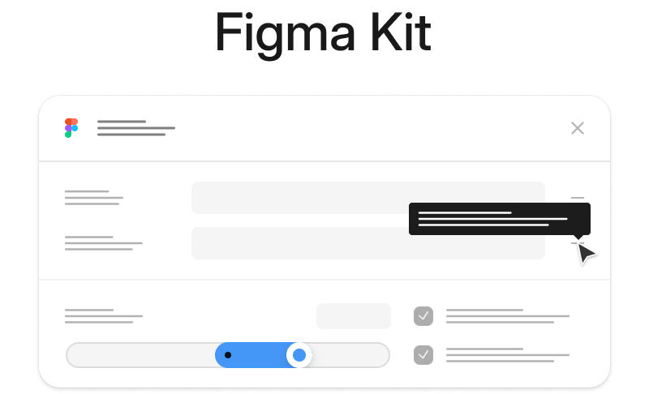

    
  <h3>A set of React components for building Figma plugins.</h3>

### Overview

Figma Kit is currently in beta and is expected to be finalized some time in Aug 2024.
The library attempts to replicate Figma's user interface look & feel with near-100% feature parity,
to get the UI engineering out of the way of building plugins.

### Documentation

The documentation for the library is on its way. Meanwhile, feel free to check out the [Storybook](https://storybook.figma-kit.dev) for available components and functionality.
