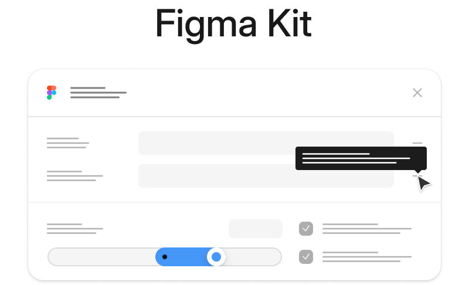

<div align="center">
  <a href="https://storybook.figma-kit.dev" target="_blank">
  <picture>
    <source media="(prefers-color-scheme: dark)" srcset="media/github-banner-dark.png">
    <source media="(prefers-color-scheme: light)" srcset="media/github-banner-light.png">
    
  </picture>
  </a>
  <h3>A set of React components for building Figma plugins.</h3>
</div>

### Overview

Figma Kit is currently in beta and is expected to be finalized some time in Aug 2024.
The library attempts to replicate Figma's user interface look & feel with near-100% feature parity,
to get the UI engineering out of the way of building plugins.

### Getting started

```bash
npm install figma-kit@beta
```

```tsx
import { 
  Button, 
  IconButton, 
  Text, 
  Flex,
  Input,
  Textarea,
  ValueField,
  Tabs,
  Popover,
  SegmentedControl,
  Checkbox,
  RadioGroup,
  Dialog,
  Select,
  ContextMenu,
  Slider,
  Switch,
  Collapsible 
} from 'figma-kit'
```

### Documentation

The documentation for the library is on its way. Meanwhile, feel free to check out the [Storybook](https://storybook.figma-kit.dev) for available components and functionality.
